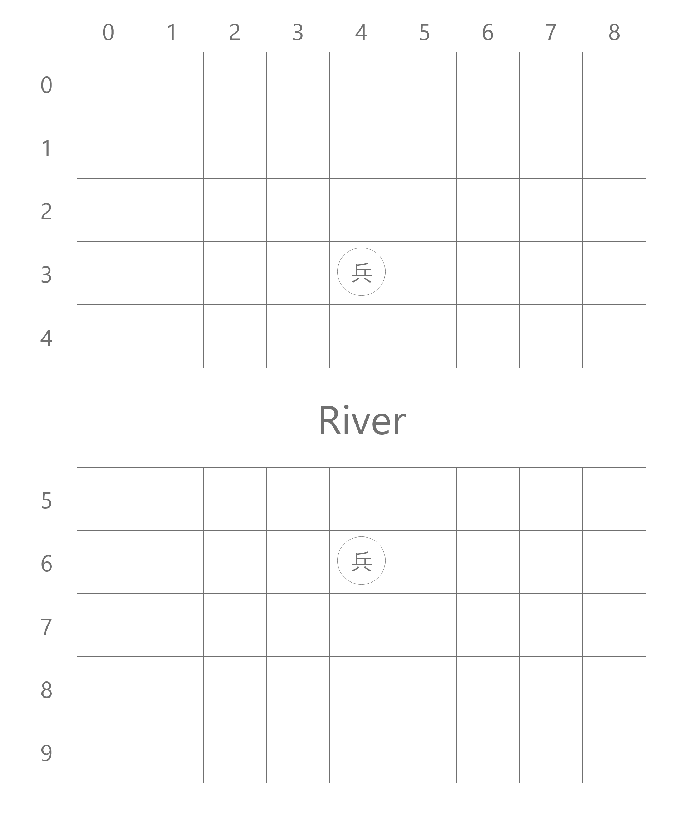
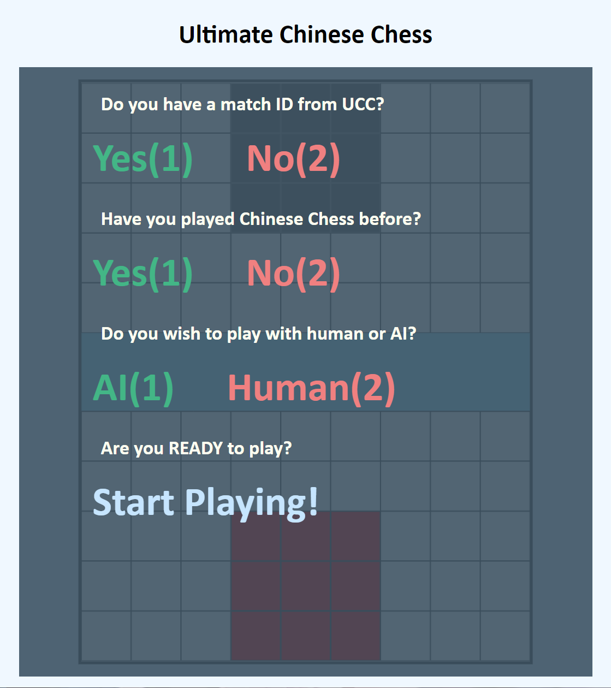

# Ultimate Chinese Chess
****

### This project(UltimateChineseChess) aims to build a web application for Chinese Chess(still working on progress) 
**If you like this project, please hit the star⭐ button to support my work!!**
****
**Demo site: https://ucc.baoning.dev** **(Not ready yet)**
****
### To run the code, you must first install the project dependencies by running:
     pip install -r requirements.txt
alternatively, you can use mirrors(Tsinghua University)     

     pip install -r requirements.txt -i https://pypi.tuna.tsinghua.edu.cn/simple
****
`>
`
**Then you might wish to create your own settings.py file, and you'd better change a secret key to keep your project safe**     

`>
`
**Once you are ready, run the following code to start your own server**

     python UltimateChineseChess_Backend/manage.py runserver

### Following is the design of the chess board

### Development Progress:
**09/22/2021**

     
**09/17/2021**

### Apache License 2.0 applied.
